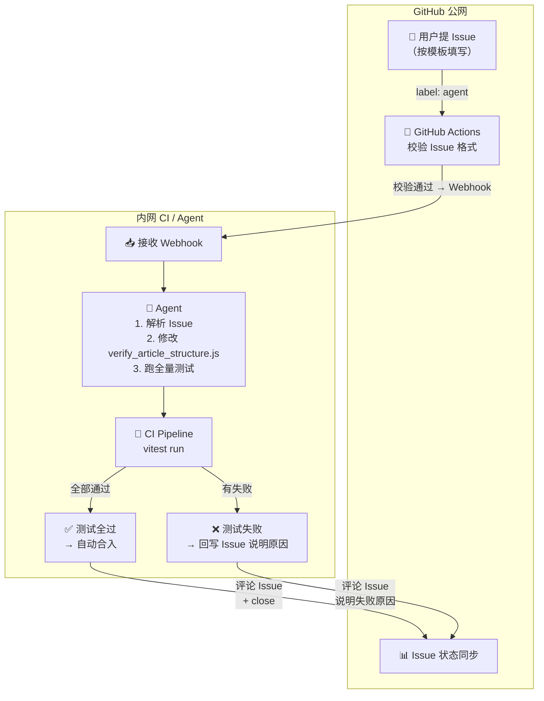

# 设计文档：Issue 驱动的规则修改闭环

> **内部文档，不对外发布。** 描述用户提 Issue → Agent 改代码 → 跑测试 → 自动合入的完整自动化流程。

---

## 整体架构




---

## 仓库分离

```
公开仓库 (verify-article-structure-spec)       私有仓库 (verify-article-structure-engine)
├── .github/                                     ├── src/
│   ├── ISSUE_TEMPLATE/rule-feedback.yml  ← 模板  │   ├── verify_article_structure.js  ← 🔒 核心逻辑
│   ├── workflows/agent-trigger.yml       ← CI    │   ├── darkmode.js
├── verify_article_structure.md           ← 规范  │   ├── editor_filter.js
├── cases.config.js                       ← 测试  │   ├── get_para_list.js
├── __tests__/                                    │   └── lib/
│   ├── unit/                                     ├── index.js
│   ├── integration/                              └── package.json
│   └── fixtures/                         ← HTML  ↑ 唯一私有的
│       ├── badcases/
│       └── goodcases/
└── package.json
```

**原则**：公开仓库只放「数据」（规范文档、测试 case、fixtures HTML），不放「逻辑」（检测引擎代码）。

---

## 分模块设计

### 1. Issue 模板

已实现：[`.github/ISSUE_TEMPLATE/rule-feedback.yml`](./.github/ISSUE_TEMPLATE/rule-feedback.yml)

必填字段：

| 字段 | 说明 | 用途 |
|------|------|------|
| `feedback_type` | 误报/漏报/新增规则/阈值调整 | Agent 据此选择修改策略 |
| `rule_name` | 涉及的规则编号 | 定位代码位置 |
| `article_url` | 公众号文章链接 | 复现和验证 |
| `description` | 期望 vs 实际行为 | Agent 理解问题 |
| `expected_behavior` | 期望的正确检测结果 | Agent 的目标 |
| `html_snippet` | 文章 HTML 片段（可选） | 精准排查，可拖拽上传 `.html` 文件 |

> GitHub Issue 支持拖拽上传 `.html` 文件，会自动作为附件关联。

### 2. GitHub Actions —— 校验 + 触发

已实现：[`.github/workflows/agent-trigger.yml`](./.github/workflows/agent-trigger.yml)

流程：
1. 监听 Issue 打上 `agent` 标签
2. 正则校验必填字段是否完整
3. 不完整 → 评论提醒 + 移除 `agent` 标签
4. 完整 → 打 `processing` 标签 → 评论通知用户 → 调用内网 Webhook

⚠️ **TODO**：Webhook 调用当前是注释状态，需要替换为实际的 Agent API 地址并配置 `AGENT_WEBHOOK_URL` secret。

### 3. 内网 CI Pipeline（蓝盾 Stream）

**目标**：在私有仓库中新增一条 CI 流水线（`.ci/rule-update.yml`），响应 Webhook 触发。

```yaml
# .ci/rule-update.yml（放在私有仓库 verify-article-structure-engine 中）
version: v2.0

on:
  manual: enabled

variables:
  issue_body: ""
  issue_number: ""

stages:
  - name: agent-modify
    jobs:
      - name: agent-fix
        runs-on: linux
        steps:
          - checkout: self

          - name: Agent 解析 Issue 并修改代码
            script: |
              node scripts/agent-fix-rule.js \
                --issue-body "${{ variables.issue_body }}" \
                --target-file src/verify_article_structure.js

  - name: run-tests
    depends_on: agent-modify
    jobs:
      - name: full-test-suite
        runs-on: linux
        steps:
          - checkout: self

          - name: 同步测试用例
            script: |
              git clone --depth 1 \
                https://github.com/xxx/verify-article-structure-spec.git \
                /tmp/test-spec
              cp -r /tmp/test-spec/__tests__/* ./__tests__/

          - name: 安装依赖
            script: npm install

          - name: 跑全量测试
            script: npx vitest run --reporter=json > test-results.json

          - name: 检查测试结果
            script: |
              FAILED=$(node -e "const r=require('./test-results.json'); console.log(r.numFailedTests || 0)")
              if [ "$FAILED" -gt 0 ]; then
                echo "TEST_FAILED=true" >> $CI_ENV
              else
                echo "TEST_FAILED=false" >> $CI_ENV
              fi

  - name: post-result
    depends_on: run-tests
    jobs:
      - name: 回写结果到 GitHub Issue
        steps:
          - name: 测试通过 → 提交代码 + close issue
            if: ${{ env.TEST_FAILED == 'false' }}
            script: |
              git add src/verify_article_structure.js
              git commit -m "fix(rule): 根据 Issue #${{ variables.issue_number }} 调整检测规则"
              git push origin master

              curl -X POST "https://api.github.com/repos/xxx/verify-article-structure-spec/issues/${{ variables.issue_number }}/comments" \
                -H "Authorization: token ${{ secrets.GITHUB_TOKEN }}" \
                -d '{"body": "✅ 规则已调整并通过全部测试，已合入主分支。感谢反馈！"}'

              curl -X PATCH "https://api.github.com/repos/xxx/verify-article-structure-spec/issues/${{ variables.issue_number }}" \
                -H "Authorization: token ${{ secrets.GITHUB_TOKEN }}" \
                -d '{"state": "closed", "labels": ["resolved"]}'

          - name: 测试失败 → 回写失败原因
            if: ${{ env.TEST_FAILED == 'true' }}
            script: |
              FAILED_DETAIL=$(node scripts/format-test-failures.js test-results.json)
              curl -X POST "https://api.github.com/repos/xxx/verify-article-structure-spec/issues/${{ variables.issue_number }}/comments" \
                -H "Authorization: token ${{ secrets.GITHUB_TOKEN }}" \
                -d "$(node -e "console.log(JSON.stringify({body: '❌ 调整后测试未通过，需人工介入。\n\n失败详情：\n' + process.env.FAILED_DETAIL}))")"

              curl -X POST "https://api.github.com/repos/xxx/verify-article-structure-spec/issues/${{ variables.issue_number }}/labels" \
                -H "Authorization: token ${{ secrets.GITHUB_TOKEN }}" \
                -d '{"labels": ["needs-manual-review"]}'
```

### 4. Agent 修改脚本

私有仓库中的 `scripts/agent-fix-rule.js`，核心逻辑：

```js
async function main({ issueBody, targetFile }) {
  // 1. 解析 Issue 内容
  const parsed = parseIssueBody(issueBody);
  //    → { feedbackType, ruleName, articleUrl, description, expectedBehavior, htmlSnippet }

  // 2. 拉取命中文章的实际 HTML（用于验证修改效果）
  const articleHtml = await fetchArticleHtml(parsed.articleUrl);

  // 3. 读取当前规则代码
  const currentCode = fs.readFileSync(targetFile, 'utf8');

  // 4. AI Agent 推理：理解需求 + 定位代码 + 生成修改
  const modifiedCode = await aiAgent.modify({
    currentCode,
    issue: parsed,
    articleHtml,
    constraints: [
      '不要修改其他规则逻辑',
      '保持代码风格一致',
      '确保修改后逻辑自洽'
    ]
  });

  // 5. 写入修改
  fs.writeFileSync(targetFile, modifiedCode);
  console.log('✅ 代码已修改');
}
```

| 输入 | 来源 | 用途 |
|------|------|------|
| `issueBody` | Webhook payload | Agent 理解用户意图 |
| `articleHtml` | 从公众号 URL 抓取 | 上下文参考，辅助定位具体 DOM 结构 |
| `currentCode` | `src/verify_article_structure.js` | 待修改的代码 |

---

## 关键设计决策

### 测试跑全量，不跑增量

检测规则之间可能有隐式耦合（比如改了 `opacity` 规则，可能影响后续 `line-height` 的段落拆分逻辑）。因此**每次修改后必须跑全量测试**。

测试分层：

```
全量测试
├── Unit Tests       ← 每个规则的独立单元测试（毫秒级，vitest + jsdom）
├── Fixture Tests    ← badcases HTML + 期望检测结果（秒级）
└── Integration Tests ← puppeteer 真实文章回归（分钟级，可选）
```

### 测试 Runner 放在私有仓库

- **公开仓库**：放测试数据（fixtures HTML + cases.config.js）
- **私有仓库**：放测试 Runner（vitest config + 单元测试文件 + setup.js）

CI 时将公开仓库的 fixtures 拉到私有仓库，用私有仓库的 Runner 驱动测试。

### 失败重试

Agent 修改后测试不通过时，最多重试 3 次。3 次后仍失败 → 打上 `needs-manual-review` 标签，通知人工介入。

---

## 落地路线

| 阶段 | 内容 | 状态 |
|------|------|------|
| **1** | Issue 模板（`.github/ISSUE_TEMPLATE/rule-feedback.yml`） | ✅ 已完成 |
| **2** | GitHub Actions 校验 + 打标签（`.github/workflows/agent-trigger.yml`） | ✅ 已完成（Webhook 调用待启用） |
| **3** | 内网 Stream CI 流水线（`.ci/rule-update.yml`） | ⬜ 待创建 |
| **4** | Agent 修改脚本（`scripts/agent-fix-rule.js`） | ⬜ 待创建 |
| **5** | 打通 Webhook → 自动触发 → 自动回写 Issue | ⬜ 待实现 |

第一步和第二步最简单也最有价值——结构化 Issue 模板让用户提交的信息可被 Agent 解析，这是整个自动化的基石。

---

## 相关文件

| 文件 | 位置 | 说明 |
|------|------|------|
| Issue 模板 | `.github/ISSUE_TEMPLATE/rule-feedback.yml` | 用户提 Issue 的结构化表单 |
| GitHub Actions | `.github/workflows/agent-trigger.yml` | 校验 + 触发 |
| 规范文档 | `verify_article_structure.md` | 规则权威源 |
| 测试配置 | `cases.config.js` | 所有测试 case 定义（包根目录） |
| 发布脚本 | `scripts/publish-spec.js` | 推送到独立 OSS 仓库 |
| 本设计文档 | `DESIGN.md` | **本文件，内部文档不对外** |
