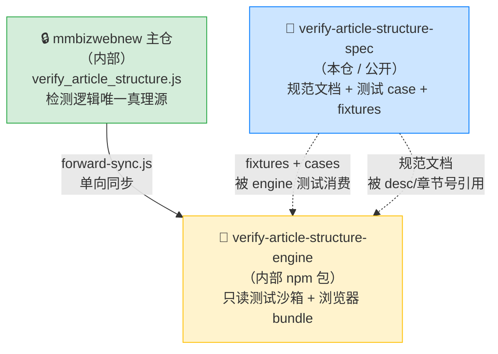
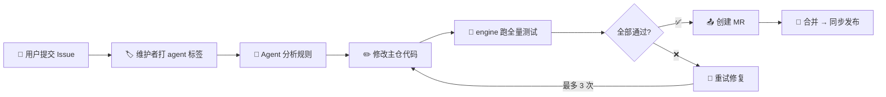

# verify-article-structure-spec

> 微信公众平台文章结构验证**规范仓**——面向第三方编辑器开发者的排版合规指南、测试用例与反馈通道。

[](https://opensource.org/licenses/MIT)

---

## 这是什么

本仓库是「文章结构验证规则」的**对外开源规范包**，包含三类内容：

| 内容 | 文件 | 作用 |
|---|---|---|
| 📜 **规范文档** | [`verify_article_structure.md`](./verify_article_structure.md) | 所有检测规则的权威定义（章节号、阈值、判定逻辑） |
| 🧪 **测试用例** | [`cases.config.js`](./cases.config.js) | 违规用例（badcases）+ 合规反向用例（goodcases）的统一定义 |
| 📂 **文章 Fixtures** | [`__tests__/fixtures/`](./__tests__/fixtures/) | 缓存的真实公众号文章 HTML，供回归测试比对 |

> **🚫 不包含检测引擎代码**——`verify_article_structure.js`（实际的 JS 检测逻辑）保留在内部仓库，不对外开源。

## 三仓关系

本仓库是「文章结构校验」体系中三个仓库之一，关系如下：



| 仓 / 包 | 角色 | 真理源 | 对外开源 |
|---|---|---|---|
| **本仓 spec** | 规范 + 测试数据 + 反馈入口 | ✅（针对规范） | ✅ |
| 内部主仓 | 检测逻辑唯一真理源 | ✅（针对逻辑） | ❌ |
| engine 包 | 只读测试沙箱（vitest + puppeteer） | ❌ 派生制品 | ❌ |

> 详细同步链路见内部文档 [`docs/SYNC_WORKFLOW.md`](./docs/SYNC_WORKFLOW.md)。

---

## 提交 Issue / 反馈规则问题

> 这是本仓库**最重要**的对外功能：用 Issue 驱动 AI Agent 自动修复规则。

### Issue 类型

| 类型 | 说明 | 标签 |
|---|---|---|
| 🐛 **误报 (False Positive)** | 文章实际是合规的，但被某条规则标记为违规 | `bug` |
| 🐛 **漏报 (False Negative)** | 某篇明显有排版问题的文章没有被检测出来 | `bug` |
| 💡 **规则建议 (Rule Suggestion)** | 建议新增一条排版检测规则 | `enhancement` |
| ⚙️ **阈值调整 (Threshold Tuning)** | 某条规则的参数（如宽度阈值 `677px`、嵌套层数 `15`）太严或太松 | `enhancement` |

### 提交流程

1. 点击 **New Issue** → 选择 **「规则反馈」** 模板
2. 按模板填写必填字段（涉及规则、文章链接、问题描述、期望行为）
3. 提交后，维护者审核并打上 `agent` 标签
4. AI Agent 自动分析 → 修改主仓代码 → 在 engine 包跑测试 → 通过后创建 MR



### 必填信息

无论哪种 Issue 类型，请务必提供：

1. **涉及规则**：指明是哪条规则（如 `2.4 width`、`2.1 opacity`、`3.1 嵌套层级`、`5.1 颜色` 等），方便快速定位。
2. **文章链接**：提供触发问题的公众号文章链接（`https://mp.weixin.qq.com/s/xxx`），用于复现和验证。
3. **问题描述**：清晰说明期望行为 vs 实际行为。

#### 误报 / 漏报额外需要

4. **文章 HTML**（强烈推荐）：截图无法反映具体样式数值，请提供 HTML 原文以达到精准排查：
   - **方式一（推荐）**：保存为 `.html` 文件，直接拖拽上传到 Issue 评论区。
   - **方式二**：在 Issue 中使用代码块粘贴关键 HTML 片段（太长可只贴 `<div id="js_content">` 内的部分）。

   > 💡 **如何提取文章 HTML**：在 Chrome 中打开文章 → F12 开发者工具 → 找到 `<div id="js_content">` 节点 → 右键 → Copy → Copy outerHTML。

#### 规则建议额外需要

4. **场景描述**：描述你遇到的排版问题场景，附上截图或效果对比更佳。
5. **检测思路**（可选）：如果你对如何自动检测该问题有思路，欢迎一并提出。

---

## 目录结构

```
verify-article-structure-spec/
├── verify_article_structure.md    ← 📜 规范文档权威源
├── cases.config.js                ← 🧪 所有测试 case 的统一定义
├── __tests__/
│   └── fixtures/                  ← 📂 文章 HTML 缓存
│       ├── badcases/              ← 违规用例文章
│       └── goodcases/             ← 合规反向用例文章
├── scripts/
│   └── fetch-fixtures.js          ← 从公众号抓取 fixtures 到本地缓存
├── docs/
│   └── SYNC_WORKFLOW.md           ← 三仓同步链路（内部参考）
├── 公众号新功能提示测试汇总/        ← 人工测试记录归档
├── .github/
│   ├── ISSUE_TEMPLATE/            ← Issue 模板
│   └── workflows/                 ← Agent 触发工作流
├── DESIGN.md                      ← Issue 驱动闭环设计文档
├── package.json
└── README.md                      ← 本文件
```

> ⚠️ 本仓库不含 `src/`、不含 vitest/puppeteer 测试 runner——**测试在内部 engine 包执行**，本仓库只提供测试**数据**（cases + fixtures）。

---

## 测试用例维护（cases.config.js）

[`cases.config.js`](./cases.config.js) 是 spec 仓与 engine 包之间的**唯一契约**——engine 包的 vitest 单测、puppeteer 集成测、本仓的 fetch-fixtures 脚本都消费同一份配置。

### 字段说明

#### `badcases`（违规用例）

| 字段 | 类型 | 必填 | 说明 |
|---|---|---|---|
| `id` | string | ✅ | 文章短链 ID（`mp.weixin.qq.com/s/` 后的部分），同时用于 fixture 文件名 |
| `url` | string | ✅ | 文章完整 URL，供 `fetch:fixtures` 拉取与集成测使用 |
| `relatedRule` | string | ✅ | 期望命中的规则 key，对应 `propertyRules` 中的键（如 `opacity` / `width` / `pre`） |
| `expectInvalidKeys` | string[] | ✅ | `inValidInfo` 实际产物中**必须出现**的外层桶名（如 `['width']`），参与断言；实际产出可多于这些 |
| `desc` | string | ✅ | 人类可读描述，**必须以 `#章节号` 开头**对应 `verify_article_structure.md` 章节，例：`'#2.1 opacity - 图片透明度为 0'` |
| `skip` | boolean | ❌ | 标记暂时无法稳定触发的 case，集成测会跳过（计入 skip 但不算 fail） |
| `skipReason` | string | ❌ | `skip:true` 时的原因说明 |
| `requireLocalTpl` | boolean | ❌ | 标记需要本地模板模式（`--use-local-tpl`）才能正确处理（如含复杂 table 的文章） |
| `note` | string | ❌ | 内部排查辅助说明，不参与断言 |

#### `goodcases`（合规反向用例）

| 字段 | 类型 | 必填 | 说明 |
|---|---|---|---|
| `id` | string | ✅ | 同上 |
| `url` | string | ✅ | 同上 |
| `desc` | string | ✅ | 人类可读描述（无章节号约束，因为合规用例不挂特定规则） |

> 期望：`isValid: true` 且 `inValidInfo` 为空。任何 `goodcase` 炸了都说明规则改严了，需立即定位修复。

### 新增 case 流程

1. 在 `cases.config.js` 的 `badcases` 或 `goodcases` 数组中追加一条记录（字段按上表填写）。
2. 抓取文章 HTML 到本地 fixtures：
   ```bash
   pnpm --filter verify-article-structure-spec run fetch:fixtures
   ```
3. 提交本仓 → engine 包测试侧自动消费新 case 跑回归。

### 维护原则

1. 每当主仓 `verify_article_structure.js` 的 `propertyRules` 注释里新增 URL，必须在 `cases.config.js` 中同步录入对应 case。
2. 新增 case 的 `desc` 必须带 `#章节号` 前缀；若规范文档中尚无对应章节，需**先补章节再加 case**。
3. `expectInvalidKeys` 是 `inValidInfo` 中「必须出现」的键，实际产物可能多于这些（多余的不影响断言通过）。
4. `skip:true` 用于「暂时测不出来」的场景——集成测跳过但不视为失败。

---

## 编辑规范文档的工作流

修改本仓内容（规范文档 / cases）的标准流程：


### 步骤 1：编辑权威源

```bash
vim packages/verify-article-structure-spec/verify_article_structure.md
# 或
vim packages/verify-article-structure-spec/cases.config.js
```

### 步骤 2：让测试在 engine 包跑一遍

```bash
cd packages/verify-article-structure-engine
npm run test:unit          # vitest + jsdom，毫秒级
npm run test:integration   # puppeteer 真实浏览器，秒级
```

> 测试 runner、mock、脚手架全部在 engine 包，本 spec 包不再维护测试代码。

### 步骤 3：bump 版本号

编辑 `package.json`，将 `version` 字段递增（如 `0.1.0 → 0.1.1`）。

### 步骤 4：提交主仓

```bash
git add packages/verify-article-structure-spec/
git commit -m "docs: 更新文章结构验证规范 v0.1.1"
git push
```

### 步骤 5：同步到开源仓库

> 当前没有自动化发布脚本，由维护者手动执行（克隆开源仓 → rsync 本目录 → commit → push）。

---

## 脚本说明

| 脚本 | 触发方式 | 作用 |
|---|---|---|
| `fetch:fixtures` | `pnpm --filter verify-article-structure-spec run fetch:fixtures` | 按 `cases.config.js` 中的 URL 从公众号抓取 HTML 缓存到 `__tests__/fixtures/` |

> **测试在哪跑？** 本仓不再维护测试 runner。所有单测 / 集成测都在 `packages/verify-article-structure-engine` 包内执行，详见 [engine 包 README](../verify-article-structure-engine/README.md)。

---

## 设计文档

| 文档 | 内容 | 受众 |
|---|---|---|
| [`DESIGN.md`](./DESIGN.md) | Issue 驱动的 Agent 自动修复闭环设计 | 维护者 |
| [`docs/SYNC_WORKFLOW.md`](./docs/SYNC_WORKFLOW.md) | 三仓（spec / 主仓 / engine）同步链路 | 维护者 |

---

## 版本历史

| 版本 | 日期 | 变更 |
|---|---|---|
| 0.1.0 | 2026-06-15 | 初始版本，从 `web-webapp-common/js/` 独立为 workspace 包 |
| —     | 2026-06-18 | 测试套件迁出至 engine 包；本仓回归「纯规范 + 数据」定位；新增 Issue 驱动闭环设计 |

---

## License

MIT
