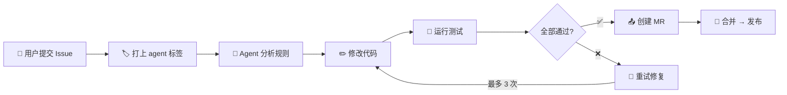
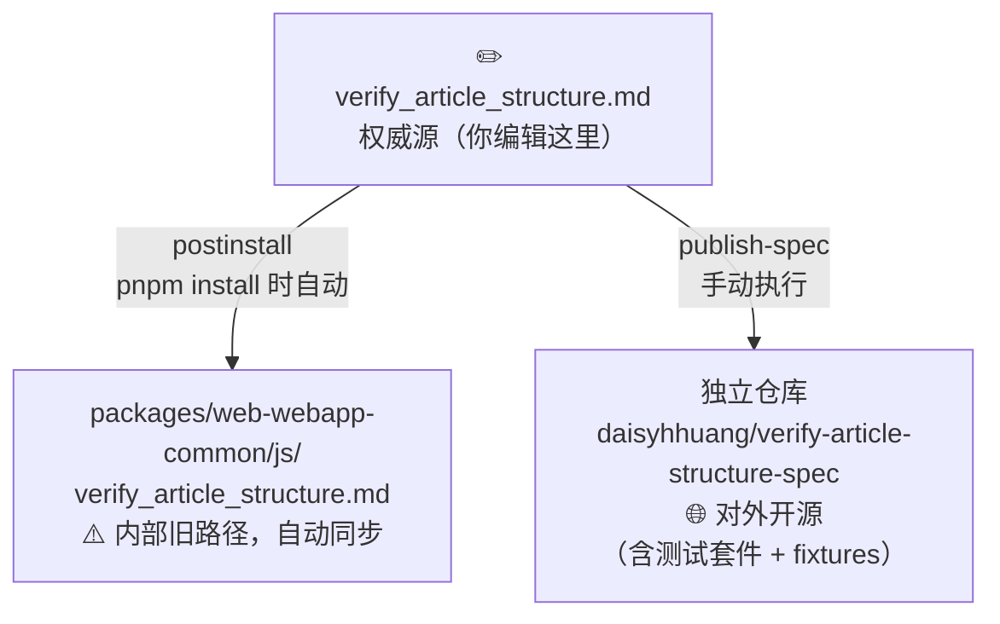

# verify-article-structure-spec

微信公众平台文章结构验证规范文档 + 完整测试套件 —— 面向第三方编辑器开发者的排版合规指南与 API 参考。

> **⚠️ 这是规范的权威源（single source of truth）。所有对该规范的修改都从这里开始。**

## 提交 Issue / 反馈规则问题

如果你在使用过程中发现规则**误报**、**漏报**或有**改进建议**，欢迎提交 Issue。我们的 AI Agent 会自动分析并尝试修复。

### Issue 类型

| 类型 | 说明 | 标签 |
|------|------|------|
| 🐛 **误报 (False Positive)** | 文章实际是合规的，但被某条规则标记为违规 | `bug` |
| 🐛 **漏报 (False Negative)** | 某篇明显有排版问题的文章没有被检测出来 | `bug` |
| 💡 **规则建议 (Rule Suggestion)** | 建议新增一条排版检测规则 | `enhancement` |
| ⚙️ **阈值调整 (Threshold Tuning)** | 某条规则的参数（如宽度阈值 `677px`、嵌套层数 `15`）太严或太松 | `enhancement` |

### 提交流程

1. 点击 **New Issue** → 选择 **「规则反馈」** 模板
2. 按模板填写必填字段（涉及规则、文章链接、问题描述、期望行为）
3. 提交后，维护者审核并打上 `agent` 标签
4. AI Agent 自动分析 → 修改代码 → 运行测试 → 测试全部通过后创建 MR



### 必填信息

无论哪种 Issue 类型，请务必提供：

1. **涉及规则**：指明是哪条规则（如 `2.4 width`、`2.1 opacity`、`3.1 嵌套层级`、`5.1 颜色` 等），方便快速定位。
2. **文章链接**：提供触发问题的公众号文章链接（`https://mp.weixin.qq.com/s/xxx`），用于复现和验证。
3. **问题描述**：清晰说明期望行为 vs 实际行为。

#### 误报 / 漏报额外需要

4. **文章 HTML**（强烈推荐）：截图无法反映具体样式数值，请提供 HTML 原文以达到精准排查：
   - **方式一（推荐）**：保存为 `.html` 文件，直接拖拽上传到 Issue 评论区。
   - **方式二**：在 Issue 中使用代码块粘贴关键 HTML 片段（太长可只贴 `<div id="js_content">` 内的部分）。

   > 💡 **如何提取文章 HTML**：在 Chrome 中打开文章 → F12 开发者工具 → 找到 `<div id="js_content">` 节点 → 右键 → Copy → Copy outerHTML。

#### 规则建议额外需要

4. **场景描述**：描述你遇到的排版问题场景，附上截图或效果对比更佳。
5. **检测思路**（可选）：如果你对如何自动检测该问题有思路，欢迎一并提出。

## 目录结构

```
packages/verify-article-structure-spec/
├── verify_article_structure.md   ← 📜 规范文档权威正本（你编辑这里）
├── cases.config.js               ← 🧪 所有测试 case 的统一定义（唯一事实来源）
├── package.json                  ← 版本号 + 测试脚本
├── README.md                     ← 本文件
├── .gitignore
├── vitest.config.js              ← vitest 单元测试配置
├── debug-fixtures.js             ← fixture 调试工具
├── __tests__/                    ← 🧪 测试套件
│   ├── unit/                     ← vitest + jsdom 单测（毫秒级）
│   │   ├── setup.js
│   │   ├── minimal-cases.test.js
│   │   └── fixture-cases.test.js
│   ├── integration/              ← puppeteer 集成测（真实文章回归）
│   │   ├── run.js
│   │   └── debug-one.js
│   └── fixtures/                 ← 本地缓存的文章 HTML
│       ├── badcases/
│       └── goodcases/
├── scripts/
│   ├── publish-spec.js           ← � 一键推送到独立开源仓库
│   └── fetch-fixtures.js         ← 从公众号抓取 fixtures
└── 公众号新功能提示测试汇总/       ← 人工测试记录
```

> ⚠️ `src/verify_article_structure.js`（检测逻辑实现）**不在本包中**，开源时不对外发布。

## 测试用例维护

所有测试 case 统一维护在包根目录的 [`cases.config.js`](./cases.config.js) 中，这是单元测试（vitest）、集成测试（puppeteer）、fixture 抓取脚本三方共用的「唯一事实来源」。

### 新增 case 流程

1. 在 `cases.config.js` 的 `badcases`（违规用例）或 `goodcases`（合规反向用例）数组中追加一条记录。
2. 跑 `pnpm --filter verify-article-structure-spec run fetch:fixtures` 拉取文章 HTML 到 `__tests__/fixtures/`。
3. 跑 `pnpm --filter verify-article-structure-spec run test:unit` 验证新增 case 能正确触发对应规则。

### 字段说明

`badcases`（违规用例）支持以下字段：

| 字段 | 类型 | 必填 | 说明 |
|---|---|---|---|
| `id` | string | ✅ | 文章短链 ID（mp.weixin.qq.com/s/ 后的部分），同时用于 fixture 文件名 |
| `url` | string | ✅ | 文章完整 URL，供 `fetch:fixtures` 拉取与集成测使用 |
| `relatedRule` | string | ✅ | 期望命中的规则 key，对应 `propertyRules` 中的键（如 `opacity` / `width` / `pre`） |
| `expectInvalidKeys` | string[] | ✅ | `inValidInfo` 实际产物中**必须出现**的外层桶名（如 `['width']`），参与断言；实际产出可多于这些 |
| `desc` | string | ✅ | 人类可读描述，**必须以 `#章节号` 开头**对应 `verify_article_structure.md` 的章节，例：`'#2.1 opacity - 图片透明度为 0'` |
| `skip` | boolean | ❌ | 标记暂时无法稳定触发的 case，集成测会跳过（计入 skip 但不算 fail） |
| `skipReason` | string | ❌ | `skip:true` 时的原因说明 |
| `requireLocalTpl` | boolean | ❌ | 标记需要本地模板模式（`--use-local-tpl`）才能正确处理（如含复杂 table 的文章） |
| `note` | string | ❌ | 内部排查辅助说明，不参与断言 |

`goodcases`（合规反向用例）支持以下字段：

| 字段 | 类型 | 必填 | 说明 |
|---|---|---|---|
| `id` | string | ✅ | 同上 |
| `url` | string | ✅ | 同上 |
| `desc` | string | ✅ | 人类可读描述（无章节号约束，因为合规用例不挂特定规则） |

> 期望：`isValid: true` 且 `inValidInfo` 为空。任何 `goodcase` 炸了都说明规则改严了，需立即定位修复。

### 维护原则

1. 每当 `verify_article_structure.js` 的 `propertyRules` 注释里新增 URL，必须在 `cases.config.js` 中同步录入对应 case。
2. 新增 case 的 `desc` 必须带 `#章节号` 前缀；若规范文档中尚无对应章节，需**先补章节再加 case**。
3. `expectInvalidKeys` 是 `inValidInfo` 中「必须出现」的键，实际产物可能多于这些（多余的不影响断言通过）。
4. `skip:true` 的 case 用于「暂时测不出来」的场景——集成测跳过但不视为失败。

## 工作流

每次修改规范文档（`verify_article_structure.md`）后，按以下步骤操作：

### 步骤 1：编辑文档

```bash
# 编辑权威源（这是你唯一需要手动改的文件）
vim packages/verify-article-structure-spec/verify_article_structure.md
```

### 步骤 2：跑测试确认无回归

```bash
# 单测（毫秒级，覆盖收集阶段规则：caret-color、animate-begin 等）
pnpm --filter verify-article-structure-spec run test:unit

# 集成测（需要本地服务，覆盖全部规则含布局测量）
pnpm --filter verify-article-structure-spec run test:integration
```

### 步骤 3：Bump 版本号

编辑 `package.json`，将 `version` 字段递增：

```json
{
  "version": "0.1.0"   // → "0.1.1"
}
```

### 步骤 4：运行 pnpm install（自动同步内部路径）

```bash
pnpm install
```

这会触发 `postinstall` 脚本，自动将最新的 `verify_article_structure.md` 拷贝到：

- `packages/web-webapp-common/js/verify_article_structure.md`（编辑器团队日常参考的旧路径）

### 步骤 5：提交到主仓库

```bash
git add packages/verify-article-structure-spec/
git commit -m "docs: 更新文章结构验证规范 v0.1.1"
git push
```

### 步骤 6：发布到独立开源仓库

```bash
pnpm --filter verify-article-structure-spec run publish-spec
```

这条命令会自动完成：

- 📦 Clone 独立仓库 `daisyhhuang/verify-article-structure-spec`
- 🧹 清空仓库旧内容
- 📝 拷贝全部内容：
  - `verify_article_structure.md` → `README.md`
  - `__tests__/`（测试套件 + fixtures）
  - `vitest.config.js`、`debug-fixtures.js`、`scripts/` 等
  - ❌ **不包含** `src/verify_article_structure.js`（内部实现，不开源）
- 📤 `git add -A` + `git commit` + `git push` 到 `master` 分支
- 🧹 清理临时目录

完成后去 https://git.woa.com/daisyhhuang/verify-article-structure-spec 查看更新。

## 测试

```bash
# 单测（快，CI 必跑）
pnpm --filter verify-article-structure-spec run test:unit

# 集成测（慢，需本地服务）
pnpm --filter verify-article-structure-spec run test:integration

# 抓取 fixtures（新增 case 后）
pnpm --filter verify-article-structure-spec run fetch:fixtures
```

### 测试设计

| 测试层 | 框架 | 速度 | 覆盖范围 |
|---|---|---|---|
| **单元测试** | vitest + jsdom | 毫秒级 | 收集阶段规则（caret-color、pre、SVG animate-begin 等） |
| **集成测试** | puppeteer | 30s+/case | 全部规则，含布局测量类（width 差异、line-height 重叠） |

两层测试共享同一份 [`cases.config.js`](./cases.config.js)（包根目录）。

## 两条同步链路



## 脚本说明

| 脚本 | 触发方式 | 作用 |
|------|---------|------|
| `postinstall` | `pnpm install` 自动触发 | 将 `.md` 同步到 `packages/web-webapp-common/js/` |
| `publish-spec` | 手动执行 `pnpm run publish-spec` | 将整个包（md + 测试套件 + fixtures）推送到独立开源仓库 |
| `test:unit` | 手动 / CI | 运行 vitest 单测 |
| `test:integration` | 手动 | 运行 puppeteer 集成测 |
| `fetch:fixtures` | 手动 | 从公众号抓取文章 HTML 缓存到 fixtures |

## 前置条件

- 本地已配置 git SSH key，能免密 push 到 `git@git.woa.com:daisyhhuang/verify-article-structure-spec.git`
- `package.json` 中的 `version` 已更新为本次发布版本号
- 集成测需要本地验证服务运行在 `http://localhost:8003`

## 版本历史

| 版本 | 日期 | 变更 |
|------|------|------|
| 0.1.0 | 2026-06-15 | 初始版本，合并测试套件，从 `packages/web-webapp-common/js/` 独立为 workspace 包 |
