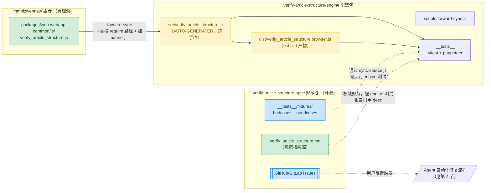
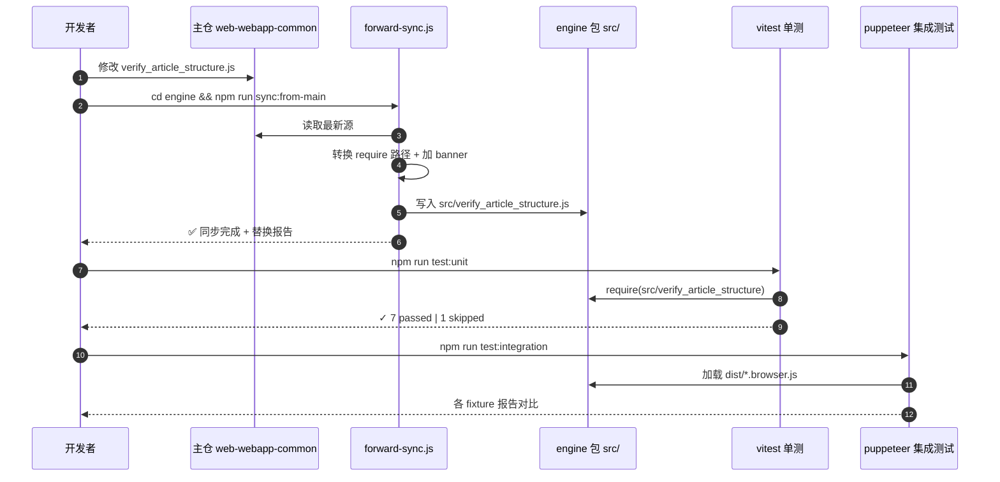
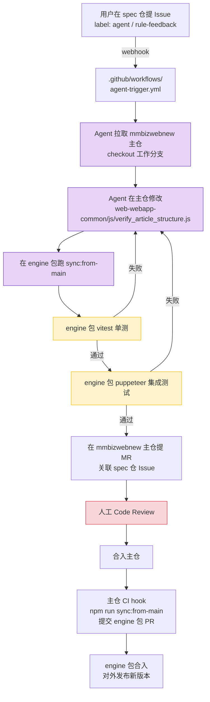

# 三仓协作与同步流程

> 本文描述 `verify-article-structure-spec`（规范仓） / `verify-article-structure-engine`（引擎包） / `mmbizwebnew/web-webapp-common`（主仓真理源） 三者之间的关系、同步方向与 Agent 自动化修复流程。

---

## 1. 三仓定位

| 仓 / 包 | 角色 | 真理源? | 是否对外开源 | Agent 是否进入 |
| --- | --- | --- | --- | --- |
| `mmbizwebnew/packages/web-webapp-common/js/verify_article_structure.js` | **检测逻辑唯一真理源** | ✅ 是 | ❌ 否（私有大仓） | ✅ 是（修复目标） |
| `packages/verify-article-structure-engine` | **只读测试沙箱** + 浏览器 bundle 制品 | ❌ 派生制品 | ❌ 否（私有 npm 包） | ✅ 是（跑测试） |
| `packages/verify-article-structure-spec` | 规范文档 + bad/good cases + 反馈通道 | ✅ 是（针对规范） | ✅ 是（开源） | ✅ 是（接收 Issue） |

**核心原则**：检测逻辑只在主仓有一份，engine 包是单向同步出来的镜像，**禁止**在 engine 包 `src/` 下手动改代码。

---

## 2. 同步方向（单向：main → engine）



### 操作命令

```bash
# 在 engine 包下执行
cd packages/verify-article-structure-engine
npm run sync:from-main          # 单向同步主仓 → engine
npm run test:unit               # 跑 vitest 单测（jsdom）
npm run test:integration        # 跑 puppeteer 真实浏览器集成测试
```

### `forward-sync.js` 做的事

1. 读取主仓 `web-webapp-common/js/verify_article_structure.js`
2. 仅在文件头前 30 行内做 `require` 路径替换：
    - 丢弃主仓未使用的 require：`constant` / `utils` / `wxgspeedsdk`
    - `@tencent/mp-common-utils/dist/get_para_list` → `./get_para_list`
    - `web-webapp-common/js/domUtils.js` → `./lib/dom_utils`
    - `web-webapp-common/js/editor_filter.js` → `./editor_filter`
    - `web-webapp-common/js/darkmode.js` → `./darkmode`
    - 移除未使用的 `deleteRedundantNode` 解构
    - `let getParaList` → `const getParaList`（风格统一）
3. 在 engine 文件顶部插入 `AUTO-GENERATED` 警示 banner（含同步时间戳）
4. 校验头部是否还有主仓路径残留，若有则非零退出（保护机制）

---

## 3. 各角色生命周期



---

## 4. Agent 自动修复闭环（spec Issue → Agent → main → engine 测试 → MR）



**关键说明**：
- Agent **直接改主仓**（真理源），不在 engine 包 `src/` 下做修改
- engine 包是**轻量测试沙箱**——秒级跑 vitest，不需要拉起 mmbizwebnew 完整 CI
- 修复有效性以"engine 包测试通过"为门槛，再走主仓 MR 评审
- 主仓合入后，CI hook 自动 sync 一次到 engine 包并提同步 PR，保证两边永远一致

---

## 5. 文件结构对照

```
mmbizwebnew/
├── packages/
│   ├── web-webapp-common/js/
│   │   └── verify_article_structure.js     ← 真理源（开发者/Agent 改这里）
│   ├── verify-article-structure-engine/
│   │   ├── src/
│   │   │   └── verify_article_structure.js ← AUTO-GENERATED（禁手改）
│   │   ├── scripts/
│   │   │   ├── forward-sync.js             ← 单向同步脚本
│   │   │   └── build-browser.js            ← esbuild 打包产物
│   │   ├── __tests__/                      ← vitest + puppeteer
│   │   └── package.json                    ← npm run sync:from-main
│   └── verify-article-structure-spec/
│       ├── verify_article_structure.md     ← 规范权威源（desc 引用编号一致）
│       ├── __tests__/fixtures/             ← bad/good cases
│       ├── docs/
│       │   └── SYNC_WORKFLOW.md            ← 本文档
│       ├── DESIGN.md                       ← spec 包总体设计
│       └── .github/workflows/
│           └── agent-trigger.yml           ← Issue → Agent 触发
```

---

## 6. 设计权衡：为什么是单向？

历史方案曾考虑双向同步（spec/engine 也能反向回写主仓），最终放弃，原因：

| 方案 | 优点 | 缺点 | 结论 |
| --- | --- | --- | --- |
| 双向同步 | engine 也能直接改 | 双真理源，团队撞车；require 反向映射易错；失去"分离"意义 | ❌ 弃用 |
| **单向同步（当前）** | 真理源唯一；engine 是只读派生制品；Agent 改主仓更安全 | engine 临时调试需要先改主仓再 sync | ✅ 采用 |

**根本逻辑**：engine 包的核心价值是"**消费方**"——用于跑测试、对外提供 npm 制品、给 Agent 一个轻量沙箱，它从来不应该是"**生产方**"。

---

## 7. 兜底与防误改

- engine 包 `src/verify_article_structure.js` 顶部有 `AUTO-GENERATED` banner，明确警示
- `forward-sync.js` 末尾有路径残留校验，规则缺漏时非零退出
- 推荐在 engine 包加 husky pre-commit hook，禁止直接 commit `src/verify_article_structure.js`（仅允许 sync 脚本写入）— 后续可加

---

> 维护者：文章结构校验工程小组
> 最近更新：2026-06-18
